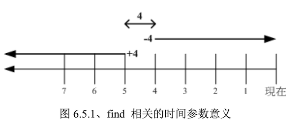

# 指令与文件的搜寻
很有用的功能之一，需要搜索某个文件在哪个位置，因为很多软件的配置文件名是不变的，
但是各 distribution 放置的目录则不同。要把位置找出来才能修改配置

## 脚本文件名的搜索
我们已经知道在终端模式下，连续两次「tab」有指令补全的功能，能展示出想匹配的指令，
那么这些指令在哪里呢?

### which 搜索执行文档

```bash
which [-a] command

-a：将所有 PATH 目录中可以找到的指令均累出，而不止第一个被找到的指令名称
```

```bash
# 搜索 ifconfig 这个指令完整文件名
[root@study tmp]# which ifconfig
/sbin/ifconfig

# 查看 which 在哪个位置
[root@study tmp]# which which
alias which='alias | /usr/bin/which --tty-only --read-alias --show-dot --show-tilde'
        /bin/alias
        /usr/bin/which

# 这里发现了两个 which，其中一个是 alias
# alias 是指令的别名，输入 which 后，就等于属于了等于后面的那一串指令
# 更多的数据在后续的 bash 章节中讲解

# 找出 history 指令的完整文档名
[root@study tmp]# which history
/usr/bin/which: no history in (/usr/lib64/qt-3.3/bin:/usr/local/sbin:/usr/local/bin:/sbin:/bin:/usr/sbin:/usr/bin:/root/bin)
# 上面在列出的目录中没有找到
# 下面报错没有 --help 这个选项
[root@study tmp]# history --help
-bash: history: --: 无效选项
history: 用法:history [-c] [-d 偏移量] [n] 或 history -anrw [文件名] 或 history -ps 参数 [参数...]

```

上面 history 为什么找不到？

- which 根据 PATH 环境变量中的目录来搜索的
- 只能找出执行文件
- history 是 bash 内置的指令

history 不在 PATH 内的目录中，是 bash **内置的指令**，
但是可以通过 type 指令，后续章节 bash 详解

## 文件名的搜索
linux 中有许多搜索指令，通常 find 不很常用，因为速度慢，操硬盘（啥意思？），
一般先用 whereis 或则是 locate 来检查，如果找不到，则用 find 来搜索。

- whereis 只找系统中某些特定目录下的文件，速度快
- locate 则利用数据库来搜索文件名的，速度块
- find 搜索全磁盘内的文件系统状态，耗时

### whereis 由一些特定的目录中搜索文件名

```bash
whereis [-bmsu] 文件或目录名
```

- l：列出 whereis 会去查询的几个主要目录
- b：只找 binary 格式的文件
- m：只找在说明文件 manual 路径下的文件
- s：只找 source 来源文件
- u：搜索不在上述三个选项中的其他特殊文件

```bash
# 找到 ifconfig 文件名
# 下面发现找到了两个包含 ifconfig 的
[root@study tmp]# whereis ifconfig
ifconfig: /usr/sbin/ifconfig /usr/share/man/man8/ifconfig.8.gz

# 找到与 passwd 有关的说明文件文件名（man page）
[root@study tmp]# whereis passwd
passwd: /usr/bin/passwd /etc/passwd /usr/share/man/man1/passwd.1.gz /usr/share/man/man5/passwd.5.gz

# 这里添加 -m 参数就只找说明文件了
[root@study tmp]# whereis -m passwd
passwd: /usr/share/man/man1/passwd.1.gz /usr/share/man/man5/passwd.5.gz

```

whereis 主要是针对 /bin/sbin 下的执行文件、/usr/share/man 下的 man page 文件、和几个特定的目录，所以速度块很多，由于不是全盘查找，可能找不到你想要的文件，可以使用 whereis -l 来显示具体会找那些目录

### locate / updatedb

```bash
locate [-ir] keyword
```

- i：忽略大小写的差异
- c：不输出文件名，仅计算找到的文件数量
- l：仅输出几行，例如输出五行则是 -l 5
- S：输出 locate 所使用的数据库文件相关信息，包括该数据库记录的文件/目录数量等
- r：后面可接正规表示法的显示方式


```bash
# 找出系统中所有与 passwd 先关的文件名，且只列出 5 个
[root@study tmp]# locate -l 5 passwd
/etc/passwd
/etc/passwd-
/etc/pam.d/passwd
/etc/security/opasswd
/usr/bin/gpasswd
# 可以看到找到了 9 前多个相关的
[root@study tmp]# locate -c 5 passwd
9863

# 列出 locate 查询所使用的数据库文件与各数据数量
[root@study tmp]# locate -S
数据库 /var/lib/mlocate/mlocate.db:
        11,623 文件夹
        153,170 文件
        7,466,565 文件名中的字节数
        3,468,856 字节用于存储数据库
```

locate 可以其实就是模糊搜索，只要包含关键词的文件名都会被匹配，他是他有一个限制，
查找的数据是已建立的数据库 /var/lib/mlocate 里面的数据来搜索的。

该数据库建立默认是每天执行一次（每个 distribution 不同，CentOS 7 是每天更新一次数据库），
所以能搜索到的结果是有延迟的

可以手动触发数据库的更新，直接使用 updatedb 指令就可以

- updatedb

  根据 /etc/updatedb.config 的设置去搜索系统盘内的文件名，并更新到 /var/lib/mlocate 数据库文件内
- locate：从 /var/lib/mlcate 内的数据库中搜索关键词

### find

```bash
find [path] [option] [action]
```
#### 与时间有关的参数
与时间有关的参数有 -atime、-ctime、-mtime，以 -mtime 说明：

- mtime n：在 n 天前的「一天之内」被修改过内容的文件
- mtime +n：列出在 n 天之前（不含 n 本身）被修改过内容的文件
- mtime -n：列出在 n 天之内（含 n 天本身）被修改过内容的文件
- newer file：file 为一个存在的文件，列出比 file 还要新的文件

```bash
# 将过去系统上 24 小时内有更动过内容（mtime）的文件列出
find / -mtime 0
# 0 表示当前时间，也就是当前时间开始往前 24 小时，也就是 24 小时内被修改过的文件

# 3 天前，24 小时内，如下
find / -mtime 3

# 寻找 /etc 下的文件，如果文件日期比 /etc/passwd 新旧列出
find /etc -newer /etc/passwd

# 列出 4 天内被更动多的文件
find / -mtime -4
```

mtime 选项的 n 正负数差别表示不同的含义，图示如下



- `+4`：表示大于等于 5 天前的
- `-4`：表示小于等于 4 天内的
- 4：表示 4~5 哪一天的文件

#### 与使用者或组名有关的参数

- uid n：n 为数字，是用户的账户 ID（UID)，UID 记录在 /etc/passwd 里面与账户名称对于的数字。后续介绍
- gid n：n 为数字，是组名的 ID，记录在 /etc/group 文件中
- user name：name 为使用者账户名称，如 mrcode
- group name：name 为组名
- nouser：寻找文件的拥有者不存在 /etc/passwd 的人
- nogroup：寻找文件的拥有群组不存在 /etc/group 的文件

  当你自行安装软件时，很可能该软件的属性当中并没有文件拥有者，这个时候就可以使用 nouser 与 nogroup

实践与练习

```bash
# 查找 /home 下属于 mrcode 的文件
find /home/ -user mrcode
# 比较有用，如找到一个用户在系统中的所有文件时

# 查找系统中不属于任何人的文件
[root@study ~]# find / -nouser
find: ‘/proc/19655/task/19655/fd/5’: 没有那个文件或目录
find: ‘/proc/19655/task/19655/fdinfo/5’: 没有那个文件或目录
find: ‘/proc/19655/fd/6’: 没有那个文件或目录
find: ‘/proc/19655/fdinfo/6’: 没有那个文件或目录
find: ‘/proc/19657’: 没有那个文件或目录
find: ‘/proc/19668’: 没有那个文件或目录
find: ‘/proc/19669’: 没有那个文件或目录
find: ‘/proc/19670’: 没有那个文件或目录

# 这里没有找出来，但是报错了一些目录不存在，不知道是啥原因
# 透过这个指令，可以轻易的找出那些不太正常的文件，如果找到了，那么有可能是正常的，比如你以源码编译软件时
```

nouser 和 nogroup 的选项，除了你自行由网络上面下载文件时会发生之外，如果你将系统里面某个账户删除了，
但是该账户以及在系统内建立了很多文件，那么就可能发生 nouser 和 nogroup 的文件

#### 与文件权限及名称有关的参数

- name filename：查找文件名为 filename 的文件
- size [-+]SIZE：查找比 SIZE 还要大（+）或则小（-）的文件

  SIZE 支持的单位有：
  - c：byte
  - k：1024 byte

  所以要查找 比 50 KB 还要大的文件，指令为 `find /home/ -size +50ks`
- type TYPE：查找文件类型为 TYPE 的。主要有

  - f：一般正规文件
  - b,c：装置文件
  - d：目录
  - l：连接
  - s：socket
  - p：FIFO
- perm mode：查找文件权限「刚好等于」mode 的文件，mode 为类似 chmod 的属性。

  例如：-rwsr-xr-x 的属性为 4755
- perm -mode：查找文件权限「必须要全部包括 mode 的权限」的文件

  例如：查找 -rwxr--r-- ，即 0744 的文件，使用 -perm -0744
- perm /mode：查找文件权限「包含任意 mode 的权限」的文件

  例如：-rwxr-xr-x，即 -perm /755 时，但一个属性属性为 -rw------ 也会被列出来，
  因为他有 -rw 的属性存在

实践与练习

```bash
# 找出文件名为 passwd 的文件
find / -name passwd

# 找出包含了 passwd 关键词的文件
find / -name "*passwd*"

# 找出 /run 目录下，文件类型为 socket 的文件
find /run -type s
# -type 属性也很有用，可以找出那些怪异的文件
# 列入 socket 与 FIFO 文件，可以使用 find /run -type p 或 -type s 来找

# 查找文件中含有 SGID 或 SUID 或 SBIT 的属性
find / -perm /7000
# 7000 就是 ---s--s--t
```

上面范例中比较有趣的是 -perm 可以找出特殊权限的文件，SUID 与 SGID 都可以设置在二进制文件上

```bash
# 找出 /usr/bin /usr/sbin 具有 SUID 或 SGID 的文件
find /usr/bin /usr/sbin -perm /6000
# SUID=4、SGID=2、SBIT=1
```

#### 额外可以进行的动作

- exec command：command 为其他指令，-exec 后面可再接额外的指令来处理搜索到的结果
- print：将结果打印到屏幕上，这个动作是预设的，不然不会看到结果

实践与练习

```bash
# 将上个范例找到的文件使用 ls -l 列出来
find /usr/bin /usr/sbin -perm /6000 -exec ls -l {} \;
# -exec 后面的 ls -l 就是额外的指令，指令不支持命令别名
# 所以只能使用 ls -l 而不能使用 ll

# 找出系统中，大于 1MB 的文件
find / -size +1M
```

find 的特殊功能就是可以进行额外的动作（action），图解一个范例


- `{}`：表示由 find 找到的内容
- `-exec 开头到 \; 结尾`：中间的表示指令额外动作
- `;`：在 bash 环境下又特殊意义的，用斜杠 `\` 来跳脱

说使用 find 在寻找数据的时候相当操硬盘是啥意思？耗费硬盘？所以能用 whereis 与 locate 操作的尽量用

### 删除 n 天前的文件
笔者这里既然学习了 find 知识点，现在拿出之前在工作中经常用到删除 n 天前的指令来分析下，
看能不能看懂

```
find /usr/local/backups -mtime +10 -name "*.*" -exec rm -rf {} \;

-mtime ：表示文件修改时间
+10 ：表示 10 天前的（不含 10 哪一天）
name：查找文件名，后面使用了通配符，查找所有的文件
-exec rm -rf {} \； 使用执行额外动作，将查找到的文件执行了 rm -rf 删除操作
```
