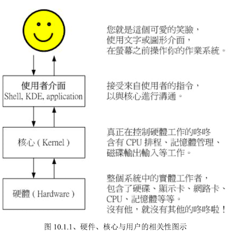

# 认识 BASH 这个 Sehll

在第一章讲到：管理整个计算机硬件的其实是操作系统的核心（kernel），一般使用者只能通过 shell 来与核心沟通。那么有系统有多少 shell 可用呢？以及为什么要使用 bash？本章告诉你答案

## 硬件、核心与 Shell

什么是 Shell？几乎上都听听到过，因为只要有操作通，那么就离不开 Shell 这个东西。在讨论 Shell之前，先来了解一下计算机的运作状况。举个例子：当你要计算机传输出来「音乐」的时候，你的计算机需要什么东西呢？

1. 硬件：有「声卡芯片」设备，才能发声
2. 核心管理：操作系统支持这个芯片组，以及提供芯片的驱动程序
3. 应用程序：需要使用者（就是你）输入发生声音的指令

这就是基本的一个输出声音所需要的步骤，可以用如下图示来说明：

在第 0 章的操作系统章节曾提到过：操作系统其实是一组软件，控制整个硬件与管理系统的活动检测，如果这组软件能被用户随意的操作，若使用者应用不当，将会使得整个系统崩溃！所以不能随便被一些没有管理能力的终端用户随意使用

但是可以考虑使用程序来指挥核心，在第 0 章所提供的操作系统图示中，可以发现应用程序其实是在最外层，就如同鸡蛋的外壳一样，因此也就被称呼为壳程序（Shell）

其实壳程序的功能只是提供用户操作系统的一个接口，因此整个壳程序需要可以呼叫其他软件的功能，如前面提到过的很多指令，包括 man、chmod、chown、vi、fdisk、mkfs 等指令，这些指令都是独立的应用程序，但是可以通过壳程序（指令行模式）来操作这些应用程序

也就是说，只要能够操作应用程序的接口都能够成为壳程序。狭义的壳程序指的是指令方面的软件，包括本章要介绍的 bash 等。广义的壳程序包括图形界面软件。

## 为何要学习文字接口的 shell？

文字接口

