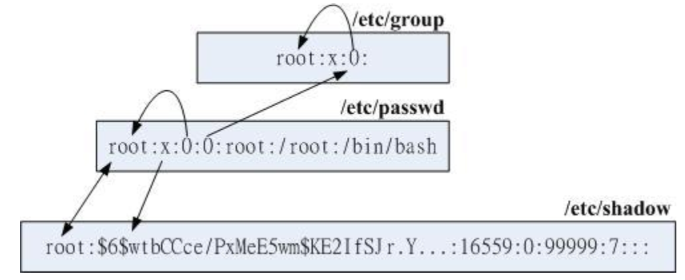

# Linux 的账户与群组

账户管理是管理员工作中相当重要的一环，并且所有一般用户的账户申请，都必须需要管理员的协助才可以，所以必须了解下如何管理好一个服务器主机账户。

在管理 Linux 主机的账户时，我们必须先来了解下 Linux 到底是如何辨别每一个使用者的

## 使用者标识符：UID 与 GID

登录使用的账户，但是账户与 ID 对应在 /etc/passwd 中，Linux 主机针对 ID 进行识别

比如下载过 tarball 类型的文件，解压之后的文件中，文件拥有者的字段可能显示「不明的数字」，这说明在很多场景下几乎上都是用 ID 来识别的

在第 5 章中提到过，每一个文件都具有「拥有人与拥有群组」的属性，所以每个使用者至少会取得两个 ID:

- UID：user id
- GID：group id

文件也是通过 UID 与 GID 来判别他的拥有者与群组的，当有要显示文件属性的需求时，系统会依据 `/etc/passwd` 与 `/etc/group` 的内容，找到 UID/GID 对应的账户与组名再显示出来。

可以通过一个小测试来验证，使用 root 身份 `vim /etc/passwd` 然后将一般身份的使用者 ID 随便更改一个号码，然后再到这个一般身份的目录下查看该账户拥有的文件，就会发现该文件的拥有人变成了「数字」

```bash
# 确定有 mrcode 账户
[root@study ~]# id mrcode
uid=1000(mrcode) gid=1000(mrcode) groups=1000(mrcode)

# 查看该文件的拥有者，显示是 mrcode
[root@study ~]# ll -d /home/mrcode/
drwx------. 16 mrcode mrcode 4096 Feb 18 13:34 /home/mrcode/

# 修改 mrcode 的 UID 1000 变成 2000
[root@study ~]# vim /etc/passwd
mrcode:x:2000:1000:mrcode:/home/mrcode:/bin/bash

# 再次查看文件的拥有者，从原先的 mrcode 变成了 1000.变成了数字
# 最后记得还原回来
[root@study ~]# ll -d /home/mrcode/
drwx------. 16 1000 mrcode 4096 Feb 18 13:34 /home/mrcode/
```

上面的例子仅说明 UID 与账户的对应性，在 LInux 下，不要随意锈钢系统上某些账户的 UID，否则可能导致某些程序无法进行。

如果上述操作，不修改回去的话，那么下次 mrcode 登录时就无法进入自己的家的目录，因为他的 UID 已经锈钢为 2000 了，但是他家目录（/home/mrcode） 却记录的是 1000，由于权限是 700，因此他讲无法进入元宝的家的目录

## 使用者账户

Linux 的用户需要通过 tty1~tty6 的终端机提供的 login 接口，并输入账户与密码后才能够登录。如果是通过网络的话，至少需要学习使用 ssh 功能（服务器篇讲解）。那么输入账户密码后，系统处理了如下东西：

1. 先找 `/etc/passwd`中是否有你输入的账户？如果有则将账户对应的 UID 与 GID（在/etc/group）读出来，该账户的家目录与 shell 设置也读出来。如果没有则跳出
2. 再核对密码表，在 `/etc/shadow`找出对应的账户与 UID，进行比对
3. 如果一切都正确，就进入 Shell 的管控阶段

大致流程如上，当登录时，`/etc/passwd`与`/etc/shadow`会被用到（很多攻击者会将特殊账户写在  `/etc/passwd` 中），所以如果要备份 Linux 系统账户，则这两个文件一定要备份

与使用者相关的两个非常重要的文件

- `/etc/passwd`：管理 UID/GID 重要参数相关
- `/etc/shadow`：管理密码相关

那么下面来简单介绍这两个文件，通过 `man 5 passwd`  和 `man 5 shadow` 了解详情

### `/etc/passwd` 文件结构

每一行表示一个账户，其中有些特殊的账户是系统正常运行所必须的，可以简称他为系统账户，例如 bin、daemon、adm、nobody 等，这些账户请不要随意的修改，那么账户内容如下所示

```bash
[root@study ~]#head -n 4 /etc/passwd
root:x:0:0:root:/root:/bin/bash		# 第一行是 root 账户
bin:x:1:1:bin:/bin:/sbin/nologin
daemon:x:2:2:daemon:/sbin:/sbin/nologin
adm:x:3:4:adm:/var/adm:/sbin/nologin

```

每个 Linux 系统都会有第一行，root 管理员这行，每行使用「:」分割为 7 个字段，分别是：

1. 账户名称：用来对应 UID

2. 密码

   早期 Unix 系统密码放在该字段上的，该文件特性是所有程序都能够读取，为了安全，则放到 `/etc/shadow` 中了，该字段使用 x 来占位，表示不使用了

3. UID

   使用者标识，通常 UID 有如下几个限制需要了解下：

   - id=0 系统管理员：所以当你要让其他的账户名称也具有 root 权限时，将该账户的 UID 修改为 0 即可。不过不建议这样做，容易让系统管理员混乱

   - id=1~999 系统账户：

     系统保留使用的 ID，除了 0 之外，其他的 UID 权限与特性并没有不一样，默认 1000 以下作为系统保留账户只是一个习惯；

     比如系统上启动的网络服务或背景服务希望使用较小的权限去运作，因此就需要这些小权限账户去执行。通常这些账户是不可登陆的，所以在第十章中提到的 `/sbin/nologin` 这个特殊的 shell 的存在

     根据系统账户的由来，通常这类账户又大概区分为两种：

     - 1~200：由 distributions 自行建立的系统账户
     - 201~999：若用户有系统账户需求时，可以使用的账户 UID
     - id=1000~60000：给一般使用者用的。在 linux 核心 3.10.x 版本，已经可以支撑到 4294967295（2的32次方-1）这么大的 UID 了

4. GID：与 `/etc/group` 有关，该文件与 `/etc/passwd`类似，只是它是用来规范组名与 GID 的对应

5. 用户信息说明

   没有什么重要用途，用来描述该账户的意义。但是使用 finger 功能时，该字段可以提供很多的信息，本章后面 chfn 指令会讲解

6. 家的目录

   以 root 为例，root 的家目录在 /root，所以当 root 登录后，就默认在 /root 目录下。

   如果你有个账户的使用空间特别的大，想要将该账户家的目录移动到其他硬盘去，就可以在该字段修改，默认的用户家目录在 /home/yourIdName

7. Shell

   在前面第十章 BASH 提到过很多次，当用户登录系统后，会取得一个 Shell 来与系统核心进行交互。该字段就是预设 shell 环境，如果想要用 shell 代替让账户无法取得 shell 环境的登录，那么就可以修改为 `/sbin/nologin`，也可以用来制作纯 pop 邮件账户者的数据

##  `/etc/shadow` 文件结构

很多程序运行都与权限有关系，权限与 UID/GID 有关，因此需要读取 `/etc/passwd` 来获取不同账户的权限。因此 `/etc/passwd`  的权限为 `-rw-r--r--`，谁都可以读取该文件，早期密码放到第个字段上，虽然也加密过，但是不安全，因为加密的密码可以通过暴力破解方式取得原始密码

```bash
[root@study ~]# head -n 4 /etc/shadow
root:$6$eC75oi.rU.wJPhgN$C.C.qFXTvmJ64qFnez88TdcsHuuQAqtAYrukgBYBspgSZbCgzvJuv4OVJ9gaEfA2/.T7e68AZW7RoZt6ubeHD0::0:99999:7:::
bin:*:17834:0:99999:7:::
daemon:*:17834:0:99999:7:::
adm:*:17834:0:99999:7:::

```

每一行一个密码，已「:」分割为 9 个字段

1. 账户名称，用来与 /etc/passwd 中账户名称对应

2. 密码：经过加密的密码

   虽然加密过，但是也有可能被破解出来，该文件的预设权限为 `-rw------ 或 ------`，因此该文件只有 root 才可以读写

   另外加密方式不同，字符串长度也不同，由于固定加密方式产生的密码长度必须一致，因此该字段长度改变后，该密码就失效了，所以有一些软件通过在该字段前加上 `! 或 *` 来达到让密码暂时失效的目的

3. 最近修改密码的日期：记录了修改密码的那一天的日期

   比如 17834 ，这个是以  1970-01-01 作为第一天而累加出来的日期，1970-01-01 + 17834 天 得到的一个时间，想要了解该日期可以使用后续讲解的 chage 指令，想要知道某个日期累计了多少天，可以使用下面的公式来计算

   ```bash
   # 2015/05/04 为计算的日期
   # 86400 是每一天的秒数
   # %s 是 1970/01/01 累计以来的总秒数
   # 由于 bash 只支持整数，因此需要加 1 来补齐 1970/01/01 当天
   [root@study ~]# echo $(($(date --date='2015/05/04' +%s)/86400+1))
   16559
   ```

4. 密码不可被修改的天数：与第 3 个字段相比

   也就是该密码最近修改之后，需要经过几天后才可以修改，0 标识不限制，非 0 ，比如 20，则标识 20 天内都无法修改密码

5. 密码需要重新锈钢的天数：与第 3 个字段相比

   也就是该密码在最近修改之后，生效的天数，如果超过这个天数则该密码为过期，不可使用。99999=273 年，也大概标识不限制了

6. 密码需要变更期限前的警告天数：与第 5 个字段相比

   在到期前 n 天，系统发出警告给该账户，告诉你该账户还有 n 天密码过期了，请尽快修改该密码。如上面的例子为 7 天，则到期之前 7 天内，系统会警告该用户

7. 密码过期后的账户宽限时间：与第 5 个字段相比

   密码有效期 = 更新日期（3 字段） + 重新变更日期（5 字段），过了该期限后用户依旧没有更新密码，那么该密码就算过期了。虽然过期了，但是还可以登录系统取得 bash。不过，当你登录系统时，系统会强制要求必须重新设置密码才能登录继续使用，这就是密码过期特性

   该字段意思为：当密码过期几天后，那么再登录系统则完全无法登录了

8. 账户失效日期

   与第 3 个字段一样，使用的是 1970 年以来的总数日设置的。表示该账户在此规定的日期之后，将无法再使用。这就是账户失效，而无论密码是否有过期，该账户都无法使用

   该字段一般会用在收费服务的系统中，规定一个日期让该账户无法使用

9. 保留：保留字段，防止以后有新功能的加入

由于 shadow 的重要性，因此不可随意修改，但是如果忘记密码了怎么办？

- 一般用户密码忘记：找系统管理员帮忙，可以以 root 身份使用 passwd 指令来处理，而不需要旧密码
- root 密码忘记：这个就麻烦了，只有通过各种手段进入 Linux 再去修改 /etc/shadow 文件，比如
  - 第 19 章中讲解的重启进入单人维护模式，系统会主动的给予 root 权限的 bash 接口，此时再用 passwd 修改密码即可
  - 使用 Live CD 开机后挂载根目录去修改 /etc/shadow 文件，将 root 的密码字段清空，再登录时就相当于不要密码了

另外，shadow 的密码加密机制，可以通过以下指令获取

```bash
[root@study ~]# authconfig --test | grep hashing
 password hashing algorithm is sha512		# 密码加密算法为 sha512
```

## 关于群组：有效与初始群组、groups、newgrp

上面讲解了两个文件，GUID 对应的两个文件则是 `/etc/group 和 /etc/gshadow` 

### `/etc/group 文件结构`

```bash
[root@study ~]# head -n 4 /etc/group
root:x:0:
bin:x:1:
daemon:x:2:
sys:x:3:
```

共 4 个字段

1. 组名：与第三字段 GID 对应

2. 群组密码

   通常不需要设置，如果非要设置，该配置也移动到 /etc/gshadow 文件中了。目前很少有机会设置群组管理员

3. GID：与 /etc/passwd 中第 4 个字段对应

4. 此群组支持的账户名称

   一个账户可以加入多个群组，某个账户加入此群组时，将该账户填入该字段即可，比如 mrcode 与 alex 加入 root 群组，该字段内容为 `mrcode,alex`，整行数据为 `root:x:0:mrcode,alex`

下面为图示 `/etc/pgroup 、 /etc/passwd 、/etc/shadow` 三个文件之间的关联关系



还有一个问题，用户可以有多个群组，那么在工作的时候以哪个群组为准？下面来讲解 **有效群组** 的概念

### 有效群组（effective group）与初始群组（inital group）

每个使用者在 `/etc/passwd` 中的第 4 个字段是 GID，该 GID 则是初始群组，当用户登录系统，立刻就拥有该群组的相关权限。

```bash
# 没有添加次要群组的信息
[root@study ~]# grep mrcode /etc/passwd /etc/group /etc/gshadow
/etc/passwd:mrcode:x:1000:1000:mrcode:/home/mrcode:/bin/bash	# 这里有的 1000 gid
/etc/group:mrcode:x:1000:mrcode	# 这个是 1000 对应的组，书上说在新版中初始群组名称不会在这一行的 第 4 个字段出现了，现在这里是出现了的，不知道是什么原因
/etc/gshadow:mrcode:!!::mrcode


# -G 修改用户所附加的群组，次要群组，也就是说，把 mrcode 账户分配给了 users 这个用户组
[root@study ~]# usermod -a -G users mrcode
[root@study ~]# grep mrcode /etc/passwd /etc/group /etc/gshadow
/etc/passwd:mrcode:x:1000:1000:mrcode:/home/mrcode:/bin/bash	# 这里 gid 指向的是 初始群组
/etc/group:users:x:100:mrcode		# 这一行是多出来的，把 mrcode 账户添加到了 users 这个用户组后面
/etc/group:mrcode:x:1000:mrcode		
/etc/gshadow:users:::mrcode			# 这一行是多出来的
/etc/gshadow:mrcode:!!::mrcode

```

那么如上， mrcode 就拥有一个初始群组 GID=1000 的（mrcode 组）和 users 组，因此在读取/写入/执行文件时，针对群组部分，只要是 mrcode 与 users 群组拥有的功能，使用者 mrcode 都可以拥有。不过这个是针对已经存在的文件而言，如果要建立一个新的文件或则是新的目录，那么新文件的群组是  mrcode 还是 users？ 这个就需要检查当时的有效群组了 

### groups：有效与支持群组的观察

如果已 mrcode 这个使用者的身份登录后，可以通过 groups 指令知道我所有支持的群组

```bash
[mrcode@study ~]$ groups
mrcode users
```

这里输出了两个群组，和上述查看到文件中内容一致，那么 **第一个输出的即为有效群组**，也就是说现在已 touch 建立一个新文件，那么该文件的拥有者为 mrcode，群组也是 mrcode 组

```bash
[mrcode@study ~]$ touch test
[mrcode@study ~]$ ll test
-rw-rw-r--. 1 mrcode mrcode 0 2月  19 18:01 test
```

### newgrp：有效群组的切换

newgrp 指令可以切换有效群组，前提为，你已经有支持的群组

```bash
[mrcode@study ~]$ newgrp users
[mrcode@study ~]$ groups
users mrcode		# 第一个输出也已经修改了
[mrcode@study ~]$ touch test2
[mrcode@study ~]$ ll test*
-rw-rw-r--. 1 mrcode mrcode 0 2月  19 18:01 test
-rw-r--r--. 1 mrcode users  0 2月  19 18:03 test2		# 可以看到已经变更了
[mrcode@study ~]$ exit	# 最后记得离开 newgrp 环境
exit
[mrcode@study ~]$ groups
mrcode users
```

newgrp 指令可以变更目前用户的有效群组，而且是以另外一个 shell 来提供这个功能